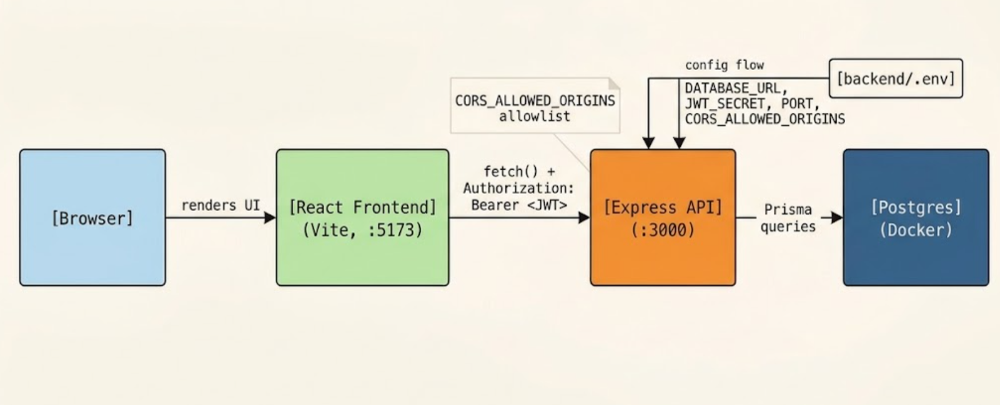
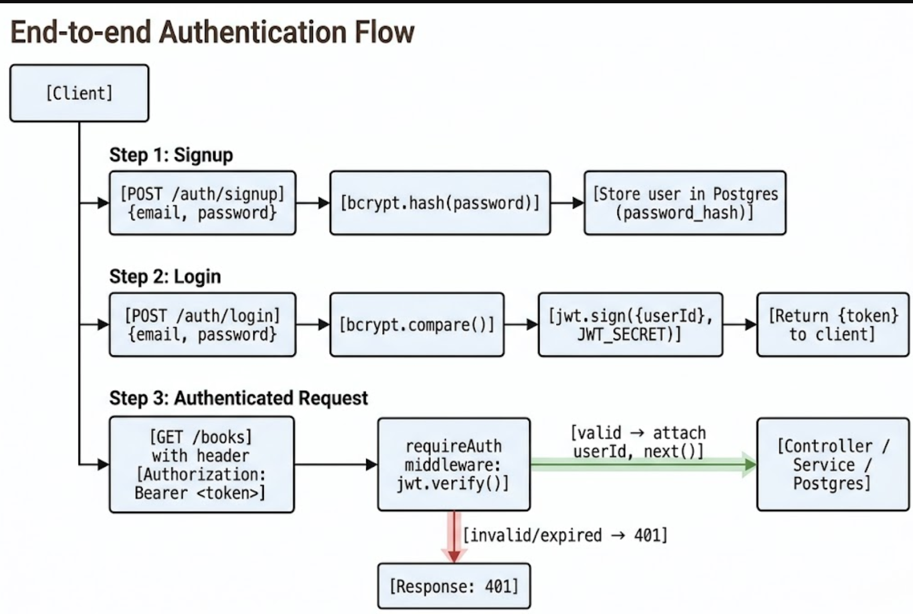

# Reading Log

It tracks reading status (`want-to-read`, `reading`, `finished`), ratings, and notes for books in the catalog.

The Reading Log is a web app built to catalog books and track reading progress, ratings, and notes in one place. Authentication secures access to the shared book catalog and platform endpoints across all users. The system is backed by a relational Postgres database and includes automated integration tests, rate-limited auth endpoints, and a fully Dockerized setup.

## Tech Stack

- **TypeScript** — chosen to catch type-mismatch errors during development rather than at runtime, providing self-documenting code and reliable autocomplete across the entire stack.
- **Express** — selected for its unopinionated, lightweight architecture, making it simple to build REST APIs and plug in custom middleware like rate limiters and authentication handlers.
- **PostgreSQL** — picked because a relational database is ideal for enforcing structured data schemas, foreign-key relationships, and strong ACID compliance.
- **Prisma** — used as an ORM to provide type-safe database queries and seamless migration management, eliminating raw SQL syntax errors while staying in sync with TypeScript models.
- **React** — chosen to keep the UI in sync with server state through hooks like `useEffect`, so the book list reflects changes immediately after a create/edit/delete.
- **Zod** — selected for schema validation because it validates incoming HTTP request payloads at runtime while automatically inferring TypeScript types.
- **JWT & bcrypt** — used together to handle secure authentication: bcrypt hashes user passwords safely before storage, while JWTs provide stateless authorization for API requests.
- **Vitest** — picked as the testing runner due to its fast execution speed, zero-config integration with TypeScript, and seamless support for unit tests and `supertest` integration tests.
- **Docker & Docker Compose** — chosen to containerize the application environment, guaranteeing that the Node server and Postgres database run identically across development machines with a single command.

## How to Run Locally

1. Clone the repository and enter the project directory:
```bash
   git clone <your-repo-url> && cd fullstack-journey
```
2. Set up environment variables:
```bash
   cp backend/.env.example backend/.env
```
   Edit `backend/.env` and fill in real values (especially `JWT_SECRET` and `CORS_ALLOWED_ORIGINS`).
3. Start everything — migrations run automatically:
```bash
   docker-compose up
```

The API will be available at `http://localhost:3000`.

# How the Layers Are Organized

The application follows a clean, single-responsibility layered architecture to separate concerns, making the codebase easier to test, debug, and maintain:

Routes (/routes): The entry point for incoming HTTP requests. Routes define the endpoint paths (e.g., /books, /auth, /health), attach necessary middleware (like authentication or rate limiting), and delegate handling directly to controllers.

Controllers (/controllers): Responsible for parsing incoming request data (params, body, headers) and returning the final HTTP response. Controllers validate user input, delegate business operations to the service layer, and catch errors to set appropriate HTTP status codes.

Services (/services): The core business logic layer. Services contain the app's domain rules, process data independent of the web framework, and handle complex logic before interacting with the database. Keeping logic here allows service functions to be unit tested without spinning up HTTP servers.

Models / Database Layer (prisma/): Handled via Prisma ORM connected to PostgreSQL. Services interact with Prisma models to query, create, update, or delete data safely using type-safe database queries.


# Auth Flow 

When a user signs up via POST /auth/signup, the application hashes the plain-text password using bcrypt before storing the new user record in PostgreSQL. Upon logging in via POST /auth/login, the server verifies the credentials against the hashed password; if valid, it generates and returns a signed JSON Web Token (JWT) containing the user's ID. For subsequent protected requests, the client sends this JWT in the HTTP Authorization header as a Bearer token (Authorization: Bearer <token>). The server's requireAuth middleware intercepts the request, verifies the signature and expiration of the token, extracts the user payload, and grants access to protected routes (like creating or updating books in the catalog).


# What's Not Yet Done

To keep this overview completely transparent, the following features, architectural improvements, and production readiness steps are currently out of scope or intentionally omitted from this build:

Per-User Data Scoping: Books in the database currently lack a userId foreign key. Authentication protects access to the catalog endpoints as a whole, but all authenticated users share, view, and modify the same global set of books rather than isolated personal collections.

Auth Endpoint Input Validation: While /books endpoints enforce strict payload validation via Zod schemas, /auth/signup and /auth/login rely on basic manual handling and lack schema validation for email formatting or password strength rules.

Automated CI/CD Pipeline: There are no GitHub Actions or automated build pipelines configured. Tests and container builds must be run manually before pushing changes.

Cloud Deployment & Infrastructure: The application is fully containerized with Docker Compose for local environments, but lacks production infrastructure configurations (e.g., AWS ECS, Kubernetes manifests, TLS/HTTPS termination, managed database instances).

Frontend Test Coverage: Automated integration and unit tests (via Vitest and Supertest) strictly cover backend API endpoints and services; no end-to-end (E2E) or component tests are currently written for the frontend UI.

Token Refresh / Revocation Mechanism: JWTs are stateless with fixed expiration times. There is currently no refresh token rotation, blacklist system, or mechanism to revoke tokens before they expire.

## Architecture Overview

### System Overview


The React frontend calls the Express API directly (no separate API gateway), guarded by CORS allowlisting and JWT-based authentication. The Express API is the only component that talks to Postgres, always through Prisma. Configuration (`DATABASE_URL`, `JWT_SECRET`, `PORT`, `CORS_ALLOWED_ORIGINS`) is injected via environment variables, never hardcoded.

### Auth Flow


See the "Auth Flow in One Paragraph" section above for the full written explanation.